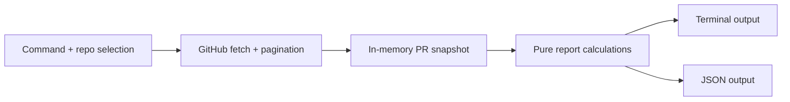

# Architecture: `gh pramen`

How the tool described in [product.md](product.md) is built. Keep this file in step with the code; the product decisions and definitions live in the product doc.

## Shape

A gh CLI extension written in Go. It uses `go-gh` for GitHub CLI integration (authentication, host and current-repository resolution, GraphQL client) and the standard library for everything else. Avoid libraries for anticipated future features.

The useful boundary is **fetch → calculate → render**. Calculations are testable without the network; renderers do not decide metric semantics. This does not require a package for every box: the code is one `main` package.

| File | Responsibility |
|---|---|
| `main.go` | Flags, repository resolution, wiring, exit codes |
| `fetch.go` | GraphQL queries, pagination, mapping API nodes to `PullRequest` |
| `report.go` | Snapshot and report types, and `buildReport`, a pure function of the fetched facts and one reference time |
| `render.go` | `writeJSON` and `writeSummary`; both only lay out what the report already contains |

**Current state:** `--json` writes the full report. The default terminal output is the summary block only: repository and collection time, open backlog, recent flow, age distribution, and review facts for non-draft PRs. GitHub's review decision is deliberately not in the summary. It ends with a line saying that per-PR rows are only in the JSON. The layout of those rows is an open decision in the product doc and should be designed against real output.

The summary is plain text with no color or terminal-width logic, so it reads the same when redirected. Counts are right-aligned within each block, and times are shown in UTC. `testdata/report.golden.txt` is a complete example.

## Data collection

Start with a fresh fetch on each run and only the fields required for the report.

- **Open PRs** come from the `repository.pullRequests(states: OPEN)` connection, 100 per page, following cursors until the last page. This is not a search query, so the 1000-result search cap does not apply.
- **Per PR:** number, title, URL, draft state, base branch, created and updated timestamps, review decision, author login and account type, pending review requests (with the automatic-CODEOWNERS flag), and each reviewer's latest approval or change request (`latestOpinionatedReviews`).
- **Review requests and latest reviews** are read up to 50 per PR. A PR with more fails the run with a message naming it, rather than reporting counts that are too low.
- **Recent flow** is one request with three search queries, reading only `issueCount`. It never reads the search results themselves, so the search cap does not apply. The window starts at an exact timestamp, 30 days before the reference time.
- **One reference time** is taken before fetching, truncated to whole seconds in UTC. Every age and the flow window are measured against it. A timestamp later than the reference time counts as zero elapsed.

Avoid commits, files, deployments, workflow runs, and full timelines. Avoid merge-conflict and check status in the bulk query too: requesting them for 100 PRs in one page returned HTTP 502 in the spike.

**No SQLite, incremental sync, persistent cache, offline mode, or migrations initially.** Measure collection time before adding caching. Measured so far: about 3 s per 100 PRs.

## Errors

The fetch returns either the complete list or an error, never a partial list. Nothing is written to stdout unless the whole report succeeded.

- A failed page or a failed flow query fails the run, with the repository and the underlying error on stderr.
- A repository that cannot be resolved produces a message pointing at `gh auth status`, because the usual cause is that the active gh account is not the one with access.
- A repository with no open PRs is a success: zero counts, all four age buckets, and an empty list.

Exit codes: 0 success, 1 runtime failure, 2 usage error. Progress (one line per page) and errors go to stderr.

## JSON output

`schemaVersion` is 1. Raise it when a field changes meaning or is removed.

| Field | Content |
|---|---|
| `repository`, `collectedAt` | `owner/name` and the reference time |
| `openBacklog` | `total`, `draft`, `nonDraft` |
| `recentFlow` | `windowDays`, `since`, `opened`, `merged`, `closedUnmerged` |
| `ageDistribution` | Always four buckets, each with `label`, `minDays`, `maxDays` (inclusive; `null` for the open-ended bucket), `total`, `draft`, `nonDraft` |
| `reviewState` | Over non-draft PRs only: their number as `nonDraft`, then counts of PRs `withApprovals`, `withChangesRequested`, `withPendingRequests`, `withOnlyCodeOwnerRequests` (a subset of the previous), and `withNoneOfThese`, plus `decision` counts. A PR can be in several of the `with*` counts |
| `reviewState.decision` | `approved`, `changesRequested`, `reviewRequired`, `notReported`, and `other` for a value GitHub adds later. These sum to `nonDraft` |
| `pullRequests` | Every open PR, oldest first: the fetched facts plus `ageSeconds` and `secondsSinceUpdate` |

Conventions: keys are camelCase; timestamps are UTC RFC 3339; durations are whole seconds; counts are always present, including zeros. `reviewDecision: null` means GitHub reported no decision. `author: null` means GitHub no longer has the account. `testdata/report.golden.json` is a complete example.

Base branch and `pendingCodeOwnerRequests` are in the JSON without a decision yet on whether or how the terminal report shows them.

## Testing

Tests are written first. Fetch and command tests run the real `go-gh` GraphQL client over a fake HTTP transport that serves fixtures from `testdata/` and records request variables, so response decoding and error handling are the real ones. `buildReport` is tested directly with a fixed reference time. Two hand-written golden files check the full JSON output and the terminal summary.

Fixtures cover pagination, empty results, an old draft, a missing review decision, an empty review decision with reviews present, a bot author, an unavailable author, a non-default base branch, truncated review data, a missing repository, and a failed page. Check representative rows against GitHub manually when the queries change.

## Why Go

- `go-gh` provides gh's auth (keyring, GHES, `GH_ENTERPRISE_TOKEN`), current-repo resolution (`GH_REPO`, git remotes), REST/GraphQL clients, and gh's own `jq` / `template` / `tableprinter`. Rust has only community crates; Rust extensions shell out to `gh auth token`, since gh passes no token to extensions (it sets only `GH_EXTENSION` and `GH_PATH`).
- `cli/gh-extension-precompile` handles cross-compiles, attestations and gh's asset naming: raw binaries ending in `<goos>-<goarch>[.exe]`, no archives, and only darwin-arm64 falls back (to amd64, if Rosetta is installed).
- The workload is network-bound, so Rust's performance advantage doesn't matter.

Releases are built by `.github/workflows/release.yml` when a `v*` tag is pushed.

## Pitfalls and design flaws to avoid

From shufo/gh-pr-stats:

- Fetching `/issues` and filtering PRs client-side wastes 2–10× requests. Query pull requests directly.
- Page count taken from a separate search call; if that call fails, the tool silently reports zero PRs. Use cursor pagination and treat errors as errors.
- Merged and closed-unmerged both counted as "closed".
- Durations rounded to whole days, so medians show 0 or 1.
- Division by zero on empty repos produces NaN, which then breaks JSON output.
- Inconsistent output schema (mixed key casing, `%` only in some rows).

General:

- Search-based queries cap at 1000 results.
- Drafts inflate waiting-time metrics unless the clock starts at ready-for-review.
- Bots skew aggregates.
- Averages get dominated by outliers; use median/p75/p90 and show `n`.
- Force-pushes rewrite commit dates; prefer `authoredDate` and fall back to PR creation.
- Squash merges break commit-based deploy mapping; map via merge commit SHA.
- Per-person rankings invite Goodhart's law; aggregate at team level and compare against the team's own baseline.

## API spike (2026-09-30)

Read-only GraphQL queries against three public repositories, fetching all open PRs through the `pullRequests(states: OPEN)` connection with cursor pagination.

| Repository | Open PRs | `reviewDecision` empty | Other values |
|---|---|---|---|
| kubernetes/kubernetes | 1,246 | 1,235 (99%) | 5 `APPROVED`, 6 `CHANGES_REQUESTED` |
| astral-sh/ruff | 477 | 445 (93%) | 1 `APPROVED`, 31 `CHANGES_REQUESTED` |
| dlvhdr/gh-dash | 15 | 0 | 15 `REVIEW_REQUIRED` |

- The spike could not read these repositories' branch rules. The pattern suggested that `reviewDecision` is populated only where branch rules require reviews; the private repository below shows that a review requirement is not sufficient either.
- An empty decision does not mean no review activity. In ruff, 17 PRs with an empty decision had an approving review and 152 had pending review requests. In kubernetes, 1,226 PRs with an empty decision had pending review requests.
- `reviewRequests { totalCount }` and `latestOpinionatedReviews { nodes { state } }` were available on every PR and need no timeline query.
- Adding these nested fields raised the cost from 1 to 2 rate-limit points per 100-PR page and roughly doubled fetch time (ruff 15 s → 27 s, kubernetes 24 s → 71 s). The slower query also fetched each PR's last commit, so the review fields alone cost less than that. The built tool, without the last commit, fetched ruff in 14 s.
- Search `issueCount` returned opened, merged, and closed-unmerged totals for a date window in one request of about a second, at a cost of 1 point. Totals above 1,000 came back intact (kubernetes, since 2026-03-01: 3,940 opened, 2,269 merged, 1,014 closed-unmerged), so the 1000-result search cap does not affect counts.

**Private repository.** The same queries were run against one private repository, read with admin permission. A repository ruleset requires one approving review on the default branch; there are no classic branch protection rules.

- `reviewDecision` was empty for most PRs to the default branch even though an approval is required there, and reported `REVIEW_REQUIRED` on some PRs to branches that no rule covers. Draft state, age, merge conflicts, author association, review content, and pending requests did not separate empty from `REVIEW_REQUIRED`; the cause is unknown.
- Where a decision was reported, it agreed with the human reviews.
- Most PRs to the default branch had a pending review request that GitHub added from CODEOWNERS (`asCodeOwner`), so a pending request does not mean someone asked for a review.
- A review bot had left a comment-only review on nearly every PR, so "has a review" is not a usable fact; approvals and change requests are.
- Adding `mergeable` and `statusCheckRollup` for 100 PRs in one page returned HTTP 502; `mergeable` alone worked in pages of 25.
- A burst of merges just inside or outside the window edge changed the 30-day merged count by more than half, so the flow counts need the exact window start shown next to them.

Repeat the spike on each further dogfood repository to validate field availability and permissions there.
